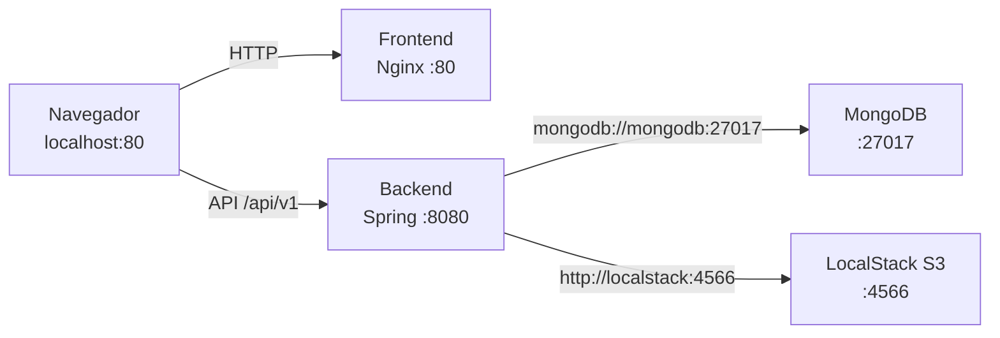

#Rede social (Bootcamp Sysmap)

## Link repositório back-end: https://github.com/gustavolucen4/Gustavo-lucena-backend
## Link repositório front-end: https://github.com/gustavolucen4/Gustavo-lucena-frontend

Aplicação full stack que simula uma rede social no estilo Twitter: frontend em React (Vite) e backend em Java (Spring Boot). O **Docker Compose** deste repositório sobe todo o ambiente necessário para rodar o projeto localmente.

## Pré-requisitos

- [Docker](https://docs.docker.com/get-docker/) e Docker Compose v2
- Repositório do frontend clonado **como pasta irmã** deste backend:

```
projetos/
├── Gustavo-lucena-backend/   ← este repositório (docker compose aqui)
└── Gustavo-lucena-frontend/
```

> O `docker-compose.yml` usa `build.context: ../Gustavo-lucena-frontend`. Se o frontend estiver em outro caminho, ajuste essa linha antes de subir os containers.

## Como rodar

Na pasta do backend:

```bash
cd Gustavo-lucena-backend
docker compose up --build
```

Para rodar em segundo plano:

```bash
docker compose up --build -d
```

Na primeira execução, o Compose **constrói as imagens** do backend e do frontend a partir dos Dockerfiles locais e sobe todos os serviços. Aguarde até o backend logar `Started BootcampBackendApplication`.

### Parar o ambiente

```bash
docker compose down
```

Para remover também os volumes (dados do MongoDB e do LocalStack):

```bash
docker compose down -v
```

## Serviços e portas

| Serviço | Container | Porta no host | Função |
|---------|-----------|---------------|--------|
| **Frontend** | `projeto-frontend` | [http://localhost](http://localhost) (80) | Interface web (Nginx servindo o build React) |
| **Backend** | `projeto-backend` | [http://localhost:8080](http://localhost:8080) | API REST Spring Boot |
| **MongoDB** | `mongodb` | `localhost:27070` | Banco de dados (usuários, posts, comentários) |
| **LocalStack** | `localstack` | [http://localhost:4566](http://localhost:4566) | Emulação do AWS S3 (upload de imagens) |

Todos os containers compartilham a rede Docker `localstack_network` e se comunicam pelos **nomes dos serviços** (`mongodb`, `localstack`, `projeto-backend`, etc.).

### Como os serviços se conectam



- **Navegador → Frontend:** você acessa `http://localhost`. O container expõe a porta 80 do Nginx.
- **Navegador → Backend:** o JavaScript no browser chama `http://localhost:8080/api/v1` (configurado no build do frontend via `VITE_API_URL`).
- **Backend → MongoDB:** dentro do Docker, usa `mongodb://mongodb:27017/db-demo` (variável `SPRING_DATA_MONGODB_URI` no compose).
- **Backend → LocalStack:** dentro do Docker, usa `http://localstack:4566` (variável `CLOUD_AWS_S3_ENDPOINT` no compose).

## Bucket S3 (upload de imagens)

O backend usa o bucket `demo-bucket` no LocalStack para avatares e imagens em posts. Esse bucket é **criado automaticamente** quando o LocalStack fica pronto, via script em `scripts/localstack-init.sh` (montado em `/etc/localstack/init/ready.d/`).

Se precisar recriar manualmente:

```bash
aws --endpoint-url=http://localhost:4566 s3 mb s3://demo-bucket
```

## Usando a aplicação

### 1. Acessar o frontend

Abra no navegador:

**[http://localhost](http://localhost)**

Você verá a tela de login do **Sysmap Parrot**.

### 2. Criar uma conta

1. Clique em **"Não possui conta? Crie uma agora!"** (rota `/singup`).
2. Preencha:
   - **Nome:** mínimo 3 caracteres
   - **E-mail:** formato válido, mínimo 6 caracteres
   - **Senha:** mínimo 6 caracteres
3. Clique em **Cadastrar**.

Após o cadastro, você é redirecionado para a tela de login.

### 3. Fazer login

1. Informe **e-mail** e **senha** cadastrados.
2. Clique em **Entrar**.

O frontend envia `POST /api/v1/auth/authenticate`, recebe um **JWT** e salva no `localStorage` do navegador (`accessToken`, `user`, `userId`, etc.). Em seguida, redireciona para `/home`.

### 4. Funcionalidades disponíveis

| Área | Rota | Descrição |
|------|------|-----------|
| Home | `/home` | Feed de posts de quem você segue |
| Perfil | `/profile` | Seu perfil |
| Amigos | `/friends` | Listar usuários, seguir/deixar de seguir |
| Post | `/post/:id` | Detalhe do post e comentários |

Também é possível **criar posts** (com texto e imagem), **curtir**, **comentar** e **alterar avatar**.

## API e Swagger (opcional)

A documentação interativa da API fica em:

**[http://localhost:8080/swagger-ui/index.html](http://localhost:8080/swagger-ui/index.html)**

Fluxo via Swagger:

1. `POST /api/v1/auth/register` — registrar usuário
2. `POST /api/v1/auth/authenticate` — obter o token JWT
3. Clique em **Authorize** e informe: `Bearer <seu-token>`
4. Explore os demais endpoints

Endpoints públicos (sem token): registro e login. Demais rotas exigem header `Authorization: Bearer <token>`.

## Comandos úteis

```bash
# Ver status dos containers
docker compose ps

# Logs do backend
docker compose logs -f projeto-backend

# Logs do frontend
docker compose logs -f projeto-frontend

# Rebuild forçado após mudanças no código
docker compose up --build
```

## Estrutura dos repositórios

| Repositório | Stack | Responsabilidade |
|-------------|-------|------------------|
| `Gustavo-lucena-frontend` | React, Vite, Tailwind | UI, chamadas à API via Axios |
| `Gustavo-lucena-backend` | Java 17, Spring Boot, MongoDB | API REST, autenticação JWT, upload S3 |

## Solução de problemas

| Problema | Possível causa | O que fazer |
|----------|----------------|-------------|
| Frontend não abre | Porta 80 ocupada | Pare o processo na 80 ou altere o mapeamento no compose (`8081:80`, por exemplo) |
| Erro ao logar / timeout | Backend ainda subindo ou MongoDB indisponível | `docker compose logs projeto-backend` e aguarde `Started BootcampBackendApplication` |
| Upload de imagem falha | LocalStack ainda subindo ou bucket ausente | `docker compose logs localstack` — deve aparecer `Creating S3 bucket: demo-bucket` |
| API retorna erro de CORS | Acesso por URL diferente de `localhost` | O build usa `http://localhost:8080/api/v1`; acesse o front por `http://localhost` |
| Build do frontend falha | Pasta do frontend no caminho errado | Confirme que `../Gustavo-lucena-frontend` existe em relação ao backend |

## Desenvolvimento local (sem Docker)

Fora do Docker, rode backend e frontend separadamente com MongoDB e LocalStack locais. Consulte os READMEs individuais de cada repositório. O `application.properties` do backend usa `localhost` para MongoDB (`27017`) e LocalStack (`s3.localhost.localstack.cloud:4566`) nesse cenário.
